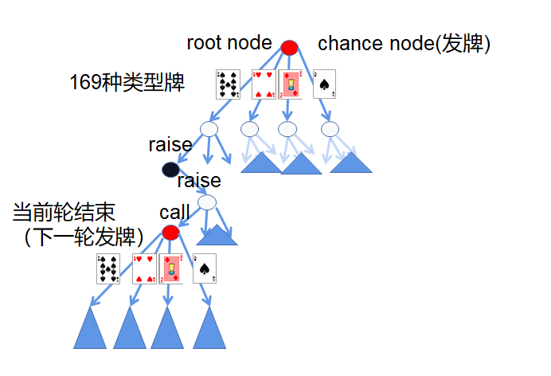
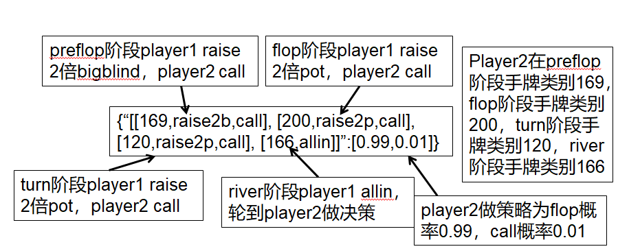

## 训练蓝图策略
首先安装项目依赖环境
```
pip install -r requirements.txt。
```
训练运行
```
python src/blueprint_algo/blueprint.py
```
蓝图策略的策略文件保存在src/blueprint_algo/start下strategpy*.gz。
## 项目文件架构
 

```
├── src                          # 蓝图策略主体
│   └── blueprint_algo              # 蓝图策略单线程整体逻辑代码
│            ├── start                 # 蓝图策略文件保存路径 strategy*.gz，文件格式在文档中
│            ├── blueprint.py             # 蓝图策略架构代码，运行这个文件进行训练
│            └── average_strategy.py      # 根据pluribus论文中φ计算蓝图策略平均策略
│
│
└── tools               # 工具包
    ├── EHS_based_v2       # 有损聚类类别代码
    ├── poker              # 游戏引擎
    │      ├── card            # 牌
    │      ├── dealer          # 庒家，为了确定出牌顺序
    │      ├── deck            # 52张牌集
    │      ├── engine          # 计算手牌输赢引擎
    │      ├── player          # 玩家
    │      ├── pot             # 底池
    │      ├── state           # 游戏状态，也是博弈树节点类
    │      └── table           # 牌桌
    └── utils              # 对象文件序列化代码
```
## 博弈树介绍
博弈树中每个节点都是一种游戏状态如下图1，博弈树每个节点为当前游戏状态的行为策略的后悔值和概率分布，在足够多的训练迭代次数之后博弈树中策略可以接近纳什均衡策略。
<p align="center">
    
</p>
<div align="center">图1 博弈树</div>

## 蓝图策略文件格式介绍和接口对接
策略文件格式为{“[[preflop动作序列], [flop动作序列], [turn动作序列], [river动作序列]]”:[动作概率分布]}
,具体例子如图2。
<p align="center">
    
</p>
<p align="center">图2 蓝图策略文件格式</p>
只要把当前游戏历史状态信息形成字符串，然后可以直接使用python的dict检索当前状态下在蓝图策略中当前节点的动作概率分布就是对应的策略。